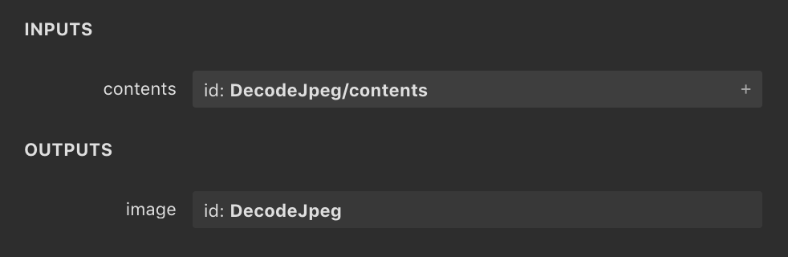

近期在计算所一直在研究 TVM，尤其是其中 NNVM 的部分。由于之前完全没接触过深度学习，也没有系统的了解过一个实际的编译器项目，所以这些工作初期会比较费力。

之前全凭自己头铁，直接硬着头皮读源码 + debug；目前好了很多，至少可以理清楚 NNVM 这套东西的基本流程了。于是把这一阶段自己记录的一些文档稍作简单整理，放在 blog 上，供以后回顾（作为黑历史）。

这篇文章将简单介绍 NNVM 读入一个已经训练好的 model 的具体流程，包括前端如何将其他深度学习框架的 model 转成 NNVM 的计算图表示，以及 NNVM 如何将计算图构建为目标平台的二进制，等等。

> 写得特别乱，也没指望大家能看懂（逃 = =

<!--more-->

---

# 从读入模型到保存编译结果

## 基本流程

> 这段基本上是在抄 API

1. 使用框架导入模型；
2. 使用 `nnvm.frontend` 中的 API 将模型转为 `symbol` 和 `params；`
    NNVM 支持下列深度学习框架：MXNet、ONNX、CoreML、Keras、TensorFlow 和 Darknet，所以对于这些框架生成的模型，NNVM 可直接利用 API 导入。

    当调用 `nnvm.frontend` 中的 API 时，会返回两个结果：
    1. `symbol`：类型为 `nnvm.Graph`，也就是 NNVM 内部表示计算图的数据结构。

        frontend API 会将外部模型中的每一个节点转换为 `nnvm.Symbol`，也就是对应的算子，然后构建 `nnvm.Graph` 并返回；

    2. `params`：类型为 `dict`。`params` 包含了计算图中的一些参数常量，例如 dense 层的 weight，或者卷积层的 kernel。

        这些常量并不包含在 `symbol` 中，而是以键值对的形式存储于图的外部，在最终运行时作为输入参数传入编译完毕的模型中。

3. 使用 `nnvm.compiler.build` 将所得的 `symbol` 和 `params` 编译；

    该 API 同时会要求指定下列输入：

    1. `graph`：上一步得到的计算图；
    2. `target`：指定目标平台，例如 LLVM、CUDA 等；
    3. `shape`：键值对，指定计算图特定输入的 shape。

        大部分情况下，计算图在编译时会执行 `InferShape` 来推断所有节点的 shape，同时也包含输入节点；但是在某些情况下必须指定这一参数；

    4. `dtype`：键值对，指定计算图特定输入的数据类型，例如 `float32`。

        同上，大部分情况下 `InferType` 可以完成这一推断，但是某些情况下依然需要明确指定输入节点的数据类型；

    5. `params`：上一步得到的 `params`。

        该 API 会根据计算图的具体内容修改 `params`，以实现图的优化；

    6. `target_host`：关于目标平台的进一步说明。可选；
    7. `layout`：指定计算图输入的 layout，例如 `NCHW`。

    API 的返回值如下：

    1. `graph`：编译完成的计算图，其类型依然为  `nnvm.Graph`。

        build 函数会根据当前的 `BuildConfig` 调用相应的 pass 对输入的计算图进行优化处理，得到的最终结果会被作为返回值返回。

    2. `lib`：编译完成的 module，类型为 `tvm.Module`。

        module 由 `GraphCompile` 这一 pass 生成。`GraphCompile` 会根据 `GraphFuse` 的结果将融合后的算子节点编译 为 `LoweredFunc`，这一过程通过调用 `CompileEngine::DoLower` 实现；同时，将所有节点编译而成的 `LoweredFunc` 存入 array。

        在 pass 结束前，array 中的内容会作为参数传入 `tvm.build` 函数，以获得计算图编译而成的 module。最终，module 会作为图的属性存入计算图。

    3. `params`：更新后的计算图参数。

        `params` 在 build 过程中会被各类 pass 更新。例如，`params` 中所有未被计算图引用的值会被删除。更新后的 `params` 将作为返回值返回。

4. 使用 `tvm.contrib.graph_runtime` 运行编译后的模型；

    1. 通过调用 `graph_runtime.create`，可以利用上一步返回的 `graph` 和 `lib` 创建一个 `GraphModule`；
    2. 为 `GraphModule` 设置输入参数，包括推理时的输入，以及图的 `params`；
    3. 调用 `run` 方法运行推理，然后使用 `get_output` 方法获得输出。

5. 保存编译后的模型。

    `nnvm.compiler.build` 方法返回的三个值，即 `graph`、`lib` 和 `params`，均可被导出，以便于后期直接导入运行。导出方法如下：

    1. `graph`：提供了 `json` 方法，可以返回图的 json 表示，直接将返回的字符串保存即可；
    2. `lib`：提供了 `export_library` 方法。调用该方法时传入路径，即可导出 module 的 tar 压缩包，包内是编译完成的目标文件；
    3. `params`：即计算图的参数，可以使用 `nnvm.compiler.save_param_dict` 来序列化，然后将序列化的结果存入文件即可。

## 一些细节

### NNVM 前端到计算图部分：

1. 从深度学习框架导入模型到 NNVM 时需要调用 `nnvm.frontend` 中的 API 来实现转换。这些 API 实际所做的内容其实就是利用对应的框架解析模型，然后遍历模型中的每个节点，根据转换关系来生成对应的 `nnvm.Symbol`，最后将 `nnvm.Symbol` 组合成 `nnvm.Graph`。

2. 最终的计算图中，模型的输入以及模型内部使用的所有常量均会被若干 Placeholder 节点代替，在运行计算图之间，必须给出所有 Placeholder 的值;

3. 计算图输入节点的名字通常情况下使用模型中第一个节点的名字。例如编译 `TensorFlow` 版的 `InceptionV1` 时，原模型中第一个节点为“DecodeJpeg/contents”，如图：

    

    则最终 build 出的计算图中，输入节点的名字也为“DecodeJpeg/contents”，即使实际上 NNVM 的 TensorFlow 前端完全忽略了 `DecodeJpeg` 算子，只是将其转换为了一个 dummy operator；

4. NNVM 前端在处理模型时，对于模型内的常量，基本上都采用了类似的处理思路：

    使用符号表统一记录，每当遇到常量时调用符号表的 `new_const` 方法，该方法会生成一个新的 Placeholder，并且自动为其分配名称；同时，符号表内的 `params` 会记录该名称实际对应了传入的常量。`new_const` 方法会返回新创建的 Placeholder。参考文件“nnvm/python/nnvm/frontend/common.py”。

### 编译和优化计算图部分：

1. `build` 函数在进行编译时，实际执行的 pass 种类取决于当前的构建配置（BuildConfig）。

    BuildConfig 中包含一个 dict，用来存放当前的优化级别，以及需要额外使用的 pass 的名称。在某一优化级别下需要用到的 pass 可以在 `OPT_PASS_LEVEL` 中查到。build 函数在执行时会检查某些 pass 是否已经在当前的 BuildConfig 中被启用，然后再决定是否执行某些 pass。

    BuildConfig 的内容可以通过 API `nnvm.compiler.build_config` 修改。详情参考文件“nnvm/python/nnvm/compiler/build_module.py”；

2. build 函数的执行流程大致如下：

    1. 检查输入参数的合法性；
    2. 获取当前的 BuildConfig；
    3. 遍历输入的 `params` 字典，将 `params` 中所有参数的 `shape` 和 `dtype` 记录在输入的 `shape` 和 `dtype` 字典中。

        因为前文已经提到，`params` 对应的各类常量在计算图中只作为 Placeholder 存在，不具备 `shape` 和 `dtype` 信息，如果不进行如此处理将会对后续的优化过程产生极大的影响；

    4. 执行 `CorrectLayout`，根据输入参数来推断计算图的 layout，并且在适当位置插入 `__layout_transform__` 算子来转换 layout。

        pass 执行完毕后，`build` 函数会更新函数内的 layout 变量以便于后续的执行过程。该 pass 位于文件“nnvm/src/pass/correct_layout.cc”；

    5. 执行 `InferShape`，根据输入参数推断计算图各节点输入和输出的 shape，包括检查节点间的 shape 是否匹配，以及在必要情况下确定某些节点的 shape 信息；
    6. 根据 `_all_var_init` 的内容读取 Placeholder 的初始值 dict。

        NNVM 前端在生成 Placeholder 时（实际上是 `nnvm.symbol.Variable`），可能会同时指定其初始值。这些初始值不会被存入生成的计算图，同时也不会出现在 params 中，而是被统一存储在一个全局变量 `_all_var_init` 中。

        这一步的目的是读取该变量中所有的初始值，并且更新 shape 和 dtype 字典，以便于后续优化。除此之外，全部初始值会被合并到 build 最终返回的 params 中，作为编译后的计算图的 params；

    7. 执行优化操作。所有优化操作被封装在了函数 `optimize` 中，该函数内部会根据当前的 BuildConfig 进行计算图的优化，可能执行的 pass 如下：

        1. `CorrectLayout`、`InferShape`、`InferType`：介绍略。

            位于文件“nnvm/src/pass/correct_layout.cc”和“nnvm/src/pass/infer_shape_type.cc”;

        2. `AlterOpLayout`：修改图中算子的 layout，并且保留之前已经推断过的 layout。

            位于文件“nnvm/src/compiler/alter_op_layout.cc”；

        3. `SimplifyInference`：检查图中所有的 `batch_norm` 和 `dropout` 算子，并且简化其输出。

            位于文件“nnvm/src/compiler/simplify_inference.cc”；

        4. `FoldScaleAxis`：关于 `conv/dense` 算子的优化，没细看。

            位于文件“nnvm/src/compiler/fold_scale_axis.cc”；

    8. 根据当前的计算图，删除 `params` 中所有未被使用的常量。因为此时计算图中的某些节点可能已经在之前的优化过程中被删除了；
    9. 执行 `PrecomputePrune`。该 pass 会将计算图进一步裁剪，只保留所有依赖计算图输入的算子，将其余部分预先计算，并且更新到 `params` 中。

        该 pass 位于文件“nnvm/src/compiler/precompute_prune.cc”；

    10. 执行算子融合优化，并且得到最终的计算图及编译为目标代码的 module。

        编译计算图的 pass 为 `GraphCompile`，位于文件“nnvm/src/compiler/graph_compile.cc”；

    11. 将之前获取到的 Placeholder 初始值存入 `params`；

    12. 返回所有结果。

# 实例:编译 TensorFlow 模型

懒得写了，不如直接看[代码](compile_model.py)。

# 实践:使用 NNVM 编译自制模型

依然懒得写，不如接着看[代码](nnvm_mnist)。

该部分中，我将之前编写的，基于 Python + NumPy 实现的 MNIST 模型使用 NNVM 编译到了目标代码，并且运行了编译结果以验证模型到 NNVM 计算图的转换过程无误。

如需查看运行结果，请执行“nnvm_mnist/basic/nnvm_test.py”。

简单测试请执行“nnvm_mnist/basic/reco.py”。
