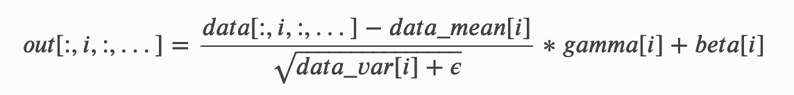
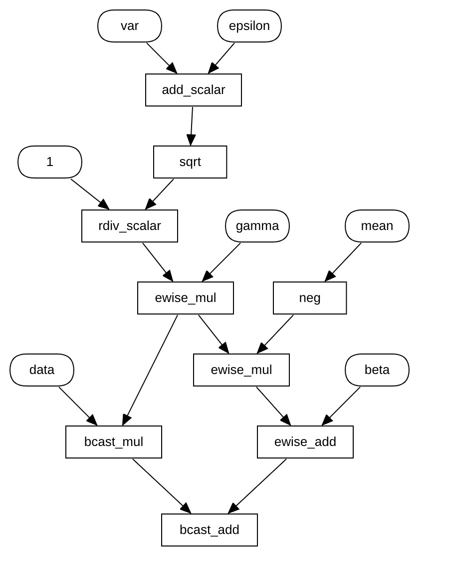

# 关于 NNVM 中 pass 的一些记录

这篇文档中记录了 NNVM 在执行编译优化过程中用到的一些 pass，以及这些 pass 的具体作用。

## SimplifyInference

> 作用：简化推理过程。

该 pass 位于文件 `nnvm/src/compiler/simplify_inference.cc` 中。

这个 pass 在 build 过程中必须执行。尝试将其从优化过程中删除，然后 build 一个带有 `Dropout` 算子的计算图，编译过程会在中途出错停止。原因是 `Dropout` 算子没有定义 `FTVMCompute` 属性，导致在执行 `DoLower` 时无法编译为目标平台代码。`BatchNorm` 算子同理。

这个 pass 会针对 `BatchNorm` 和 `Dropout` 两种算子进行处理，因为在深度学习中，这两种算子基本只会在训练时起作用，在推理时只需执行简单计算（`BatchNorm`）或者根本无需关心（`Dropout`）。

`BatchNorm` 算子在推理时主要的作用是，根据训练时确定的参数，如训练样本的均值和方差，再执行相关的变换。具体操作如下：

从公式中可以看出，我们只需要得到 `data`、`mean`、`var`、`eps`、`gamma`、`beta` 这几个参数，然后直接按照公式将 `BatchNorm` 算子替换为上述部分即可。在 `BatchNormToInferUnpack` 函数中实际上执行的就是这个步骤，函数生成了如下子图来替换原有的节点：

对于 `Dropout` 算子，该 pass 做了直接将其删除的处理，因为推理过程中并不会用到 `Dropout`。

## InferShape/InferType

> 作用：根据已知信息推断计算图的 Shape 或 Type。

这两个 pass 的执行流程是相似的，所以在 NNVM 中，两个 pass 实际上是对同一个函数的不同调用。这个函数是 `InferAttr`，它是根据计算图中所有节点推断某个 attribute 的内容的算法的抽象。

推断 Shape 或者 Type 这些信息的目的是，计算图中每个节点的 shape 或者 dtype 并非是初始确定的，它们或是被用户调用 `build` 时指定，如输入节点的 shape/dtype；或是在 `build` 函数执行之初根据传入的 `params` 的shape/dtype来确定；或是根本就没被明确指定，因为 shape/dtype 是作为节点的 attribute 存在的。

一些 pass 依赖于节点的 shape/dtype 信息，例如之前的 `SimplifyInference`，这也是在每次执行某些 pass 前都会先执行 `InferShape`/`InferType` 的原因。

`InferAttr` 函数的流程：
1. 从计算图的对应属性中读出目前的 shape/dtype，若目前不存在任何相关信息，就先假定每个节点的 shape/dtype 为空。函数执行结束时，会根据推断结果更新这些信息；
2. 从输入参数中（实际上也作为属性存储在计算图中）读取外部提供的部分 shape/dtype 信息，然后将获取到的信息更新到之前读出的 shape/dtype 信息中；
3. 假设以获取到的信息中，所有信息均为未知。循环遍历，从正向和反向两个方向推断计算图中每个节点的 shape/dtype，更新到信息列表中，然后记录此次遍历完成后，未知信息的个数；
4. 如果所有节点的信息都已经推断出来，或者未知信息个数不再发生改变时，停止循环遍历；
5. 将目前推断出的 shape/dtype 信息更新到计算图中，同时将未知信息的个数也存入计算图的属性中。

在 `InferAttr` 函数中，关键的算法是，如何根据某个节点来推断计算图的属性。这个算法以匿名函数的形式定义在了 `InferAttr` 函数的内部（`infer_step`）。该函数的执行流程如下：
1. 如果当前节点是 `Placeholder`：什么也推不出来；
2. 如果当前节点的算子是 backward operator 并且存在 forward operator：在NNVM中符合这两种情况的算子只有卷积和池化两种。首先得到 forward 的节点，然后利用算子的 `FGradient` 属性生成当前节点的 backward graph，再根据反向图的 shape/dtype 信息推断当前情况下的信息；
3. 如果当前节点不符合上述情况：其实大部分算子的节点都属于这种情况。此时，算法会根据节点对应算子的 `FInferShape`/`FInferType` 的实际情况推断 shape/dtype 信息，最后将所得信息更新到列表中。
